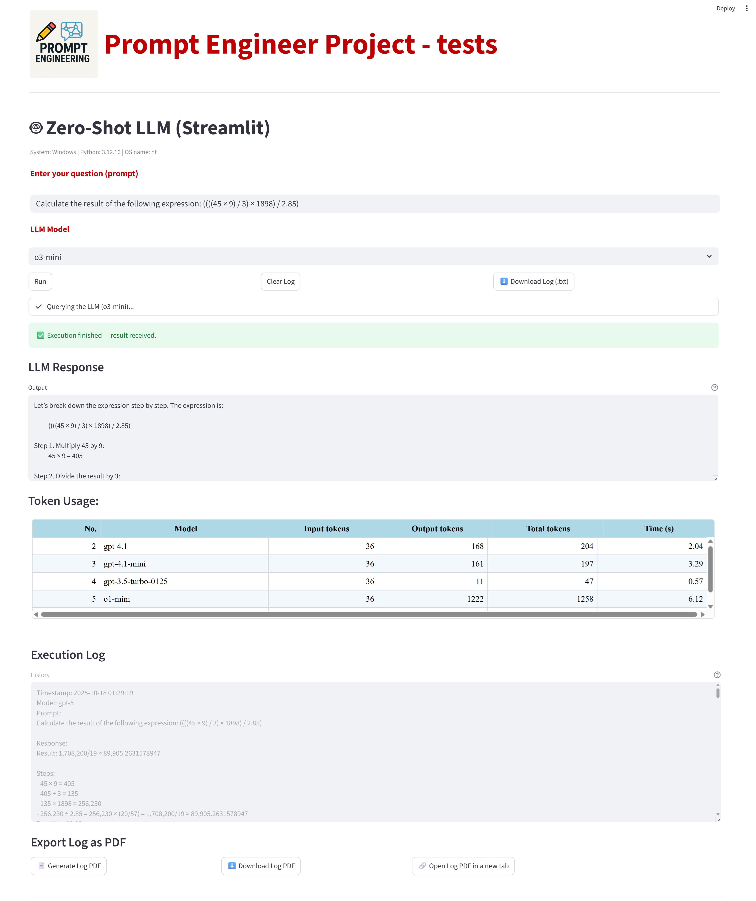
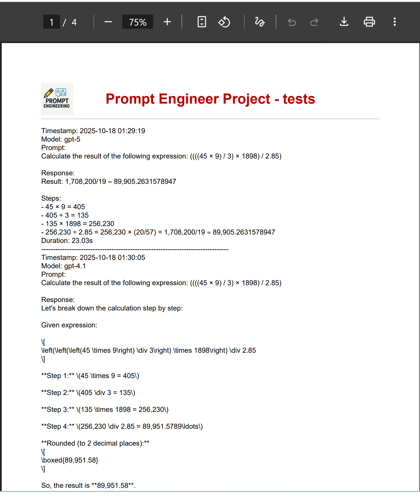

# 🤖 Prompt Engineering Project — Streamlit LLM Test Suite

This project is a **Streamlit-based interface** designed to perform **Prompt Engineering experiments** with multiple **LLM models (OpenAI / LangChain integration)**.  
It provides interactive execution, token usage tracking, and automatic **PDF log generation** — ideal for research, evaluation, or educational environments.

---

## 📋 Overview

The application allows you to:
- Interactively send prompts to different **LLM models** (e.g., GPT-4, GPT-4o, GPT-5, etc.)
- Monitor **input/output token usage** for each run
- Export execution logs as **.TXT** or **.PDF files**
- Automatically include a **custom header and logo** in the exported PDF
- Run all tests locally using **Streamlit** with full customization options (font size, color, layout)

---

## 🖼️ Application Preview

Below is a screenshot of the main interface running locally:

<p align="center">
  
</p>

---

## 🎨 PDF Example

A visual overview of the PDF Report of the app:

<p align="center">
  
</p>


---

## 🧰 Technologies Used

| Category | Tools / Libraries |
|-----------|-------------------|
| **Frontend / UI** | [Streamlit](https://streamlit.io/) |
| **Environment Management** | [python-dotenv](https://pypi.org/project/python-dotenv/) |
| **LLM Integration** | [LangChain OpenAI](https://python.langchain.com/) |
| **PDF Generation** | [ReportLab](https://www.reportlab.com/) |
| **Language** | Python 3.12.10 |

---

## ⚙️ Installation

### 1️⃣ Create a new virtual environment

```bash
python -m venv .venv
